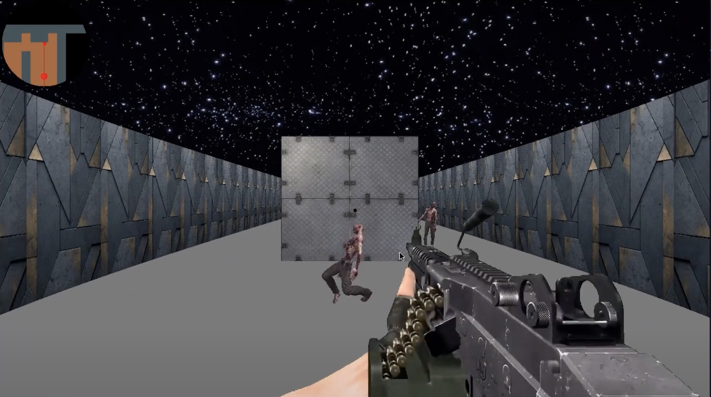

# Cube3D

A 3D raycasting game engine inspired by Wolfenstein 3D, built with MinilibX graphics library. Features dynamic lighting, textured environments, and interactive elements.

## Video Showcase

[](https://youtu.be/HV48BXeT3Z0)

*Click the image above to watch the gameplay demo*

## Screenshots

<div align="center">
  
  
  
  
  
  
  
</div>

## Features

### Core Engine
- First-person 3D perspective using raycasting technology
- Smooth movement and rotation system
- Collision detection
- Dynamic wall texturing
- Customizable lighting system

### Gameplay Elements
- Interactive doors
- Enemy AI with animations
- Weapon system with recoil and reload mechanics
- Scope/zoom functionality
- Sprint mechanics

### Visual Elements
- Dynamic lighting effects
- Smooth animations
- Screen effects (shake, recoil)
- Real-time minimap
- Enemy tracking system

## Requirements

- GCC compiler
- Make
- MinilibX library

## Building

```bash
# Clone the repository
git clone https://github.com/radouane-tamouss/Cube3D.git
cd Cube3D

# Build standard version
make

# Build bonus version (includes all features)
make bonus
```

## Usage

```bash
# Standard version
./cub3D maps/default.cub

# Bonus version
./cub3D_bonus maps/bonus.cub
```

## Controls

### Movement
- WASD - Movement
- Mouse - Look around
- Shift - Sprint
- Arrow Keys - Rotate camera

### Actions
- Left Click - Shoot
- Right Click - Scope
- E - Interact with doors
- R - Reload weapon
- Space - Toggle dark mode
- Esc - Exit game

## Project Structure

```
.
├── src/                  # Core source files
│   ├── init/            # Initialization modules
│   ├── parsing/         # Map and config parsing
│   ├── rendering/       # Graphics and ray-casting engine
│   └── utils/           # Utility functions
├── bonus/               # Additional features
│   ├── animations/      # Sprite and effect animations
│   ├── enemy_ai/        # Enemy behavior and pathfinding
│   └── weapons/         # Weapon mechanics and effects
├── lib/                 # Libraries
│   └── libft/           # Custom C library functions
├── maps/                # Game maps and level designs
├── textures/            # Game assets
│   ├── environment/     # Wall and floor textures
│   ├── weapons/         # Weapon sprites and effects
│   ├── enemies/         # Enemy character sprites
│   └── animations/      # Animation frame sequences
└── includes/            # Header files
```
## Authors

- [Radouane](https://github.com/radouane-tamouss)
- [Erabareta](https://github.com/erabareta)